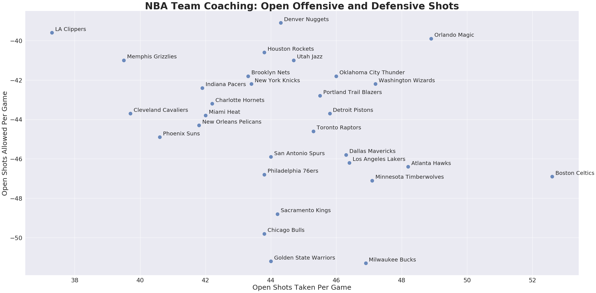
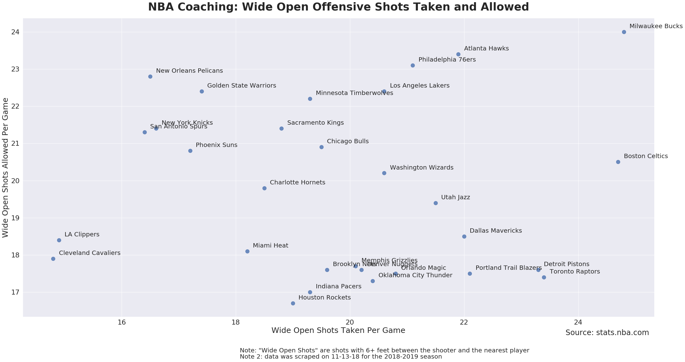

# nba-coaching

What makes a good coach? How good of a coach are they?

There are a ton of different stats with odd acronymns aimed at measuring players' on court value (BPM, RAPM, RPM, PER, WS, etc), but no such stats exist for coaches. There's a pretty good reason why though: it is difficult to seperate out what coaches are doing from what the players on the court are doing.

It would be a naive approach to look at a coaches' win percentage because players rarely change teams mid-season, and players often have a much larger impact on team success. If a good coach goes to a bad team (or has bad talent), the team doesn't suddenly become good, usually the team becomes only slightly better.

One idea: **good coaches maximize their players' talent**. How can we measure that?

So what does a high quality shot look like?

  1. An **open shot**
  2. A shot coming from a **place on the floor with high expected value**

We can start by looking at **open shots**. Players have some influence over the shots they take, but coaches design the entire offensive and defensive scheme. So I built a NBA webscraper to take data from stats.nba.com and used python's Seaborn package to plot them. 

The above figure shows how teams stack up on open shots taken and allowed per game. Orlando and Boston are examples of well coached outliers and teams like the Bulls, Warriors, and Kings aren't really maximizing their player's intrinsic value (using this metric). 

If you instead only look at wide open shots (very good looks), Detroit, Toronto, and the Celtics all look very well coached.

This has a lot of problems though. It doesn't include pace, how many shots or the quality of shots taken. 

We can solve both these problem by plotting the percentage of shots that are open instead of per game. Boston still is an outlier offensively, but a little worse defensively. Orlando looks a little worse offensively, which means they're either not creating as many shot opportunities as other teams or they're getting free throws instead. Surprisingly the Clippers are terrible at getting open looks but have also convinced other teams to not get them either.

How well are teams able to take advantage of these open looks? This graph is probably more biased by player value (Golden State is absurd at shooting!).

So we know that some teams are able to get better open looks than others, but what if they're taking shots from a poor **place on the floor**?

The expected value of a shot in the restricted area was 1.25, in the paint (not including the RA) it was 0.78. Midrange shots net you 0.81 points on average. Corner Three's and 3's above the break provide 1.13 and 1.04 points respectively. This trend is something you probably already know. Teams are taking way way way more threes than ever before because they're so much better than mid-range shots.

Trying to account for this, I took a look at a how teams stack up good shots here. San Antonio takes a lot of bad shots. I almost did a double take since Pop is such a legendary and well respected coach, but it makes sense that they have guys on their roster like Aldridge and DeRozan who have old school games. The Rockets, the Nets, the Bucks, the Pistons and the Jazz all look like they've made concerted efforts to take good shots.

That kinda didn't pass the smell test. San Antonio must be taking those shots because their guys are particularly good at them right? This is how effective teams are (vs how many bad shots they take). The Warriors are still absurd. Toronto is surprisingly good at bad shots (probably the Kawhi effect) and the Spurs are coached like they still have Kawhi.

A lot has been written about player evaluation in the NBA from a statistical perspective.  We have stats for individual players, but how do you judge a coach? 

One way to look at basketball coaching is the job of getting high quality shots for your players, and preventing opposing teams from getting good looks. The head coach is usually seen as the brains of a team, as well as a leader who is trying to maximize his players' potential. 

  
