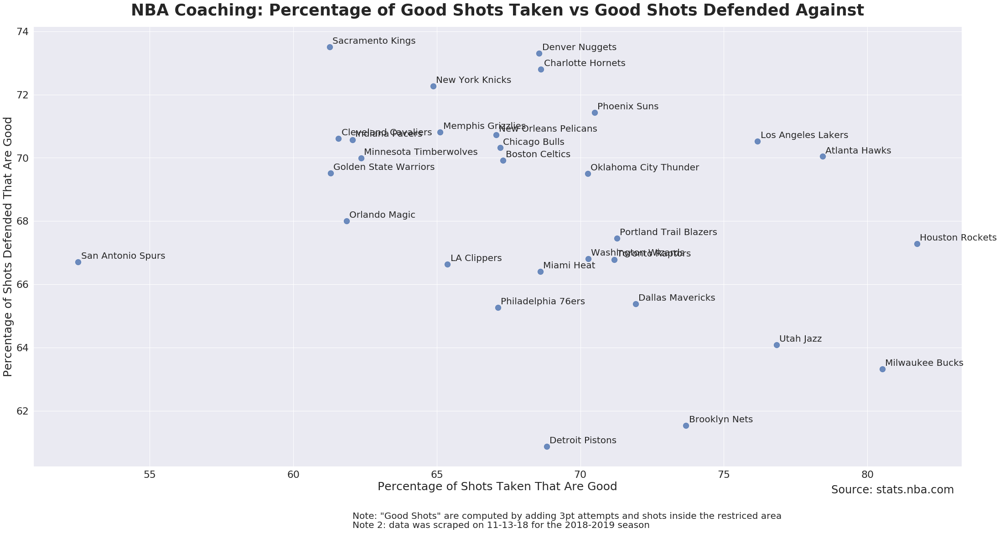

# nba-coaching

There are a lot of different stats with odd acronymns aimed at measuring players' on court value (BPM, RAPM, RPM, PER, WS, etc), but no such stat exists for coaches. There's a good reason why though: it is hard to seperate out what coaches are doing from what the players on the court are doing. 

A naive approach is to look at a coaches' win percentage because players often have a much larger impact on team success.

One idea is that **good coaches maximize their players' talent**, but how can we measure that? By getting 

So what does a high quality shot look like?

  1. An **open shot**
  2. A shot coming from a **place on the floor with high expected value**

We can start by looking at **open shots**. Players have some influence over the shots they take, but coaches design the entire offensive and defensive scheme. So I built a NBA webscraper to take data from stats.nba.com and used python's Seaborn package to plot them. 

The above figure shows how teams stack up on open shots taken and allowed per game. Orlando and Boston are examples of well coached outliers and teams like the Bulls, Warriors, and Kings aren't really maximizing their player's intrinsic value (using this metric). 

If we instead only look at wide open shots (very good looks), Detroit, Toronto, and the Celtics all look very well coached.

This has a lot of problems though. It doesn't include pace, how many shots or the quality of shots taken. 

We can solve two of these problem by plotting the percentage of shots that are open instead of per game. Boston still is an outlier offensively, but a little worse defensively. Orlando looks a little worse offensively, which means they're either not creating as many shot opportunities as other teams or they're getting free throws instead. Surprisingly the Clippers are terrible at getting open looks but have also convinced other teams to not get them either.

How well are teams able to take advantage of these open looks? 

Effective Field goal percentage is probably more biased by player value (Golden State is absurd at shooting!).

So we know that some teams are able to get better open looks than others, but what if they're taking shots from a poor **place on the floor**?

The expected value of a shot in the restricted area is 1.25, in the paint (not including the RA) it is 0.78. Midrange shots net us 0.81 points on average. Corner Three's and 3's above the break provide 1.13 and 1.04 points respectively. Over the last 10 years teams have taken more shots from places with higher expected value. Teams are taking way way way more threes than ever before because they're so much better than mid-range shots.

We can look at how good teams are at shooting from the best places on the floor:

San Antonio takes a lot of bad shots. The Rockets, the Nets, the Bucks, the Pistons and the Jazz all look like they've made concerted efforts to take good shots.

This is how effective teams are (vs how many bad shots they take). The Warriors are still absurd. Toronto is surprisingly good at bad shots (probably the Kawhi effect) and the Spurs are coached like they still have Kawhi.
